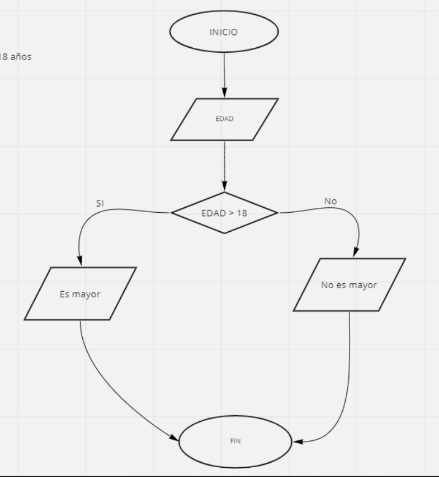

# Calcular Edad

Tomar la edad del usuario y evaluar si la edad es mayor a 18 años

 Pseudocódigo:

 INICIO
  LEER edad
   SI (edad > 18) ENTONCES
     MOSTRAR "Es mayor"
   SINO 
     MOSTRAR "No es mayor"
 FIN